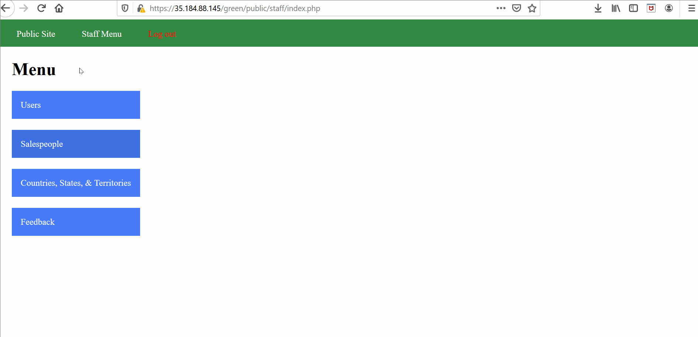
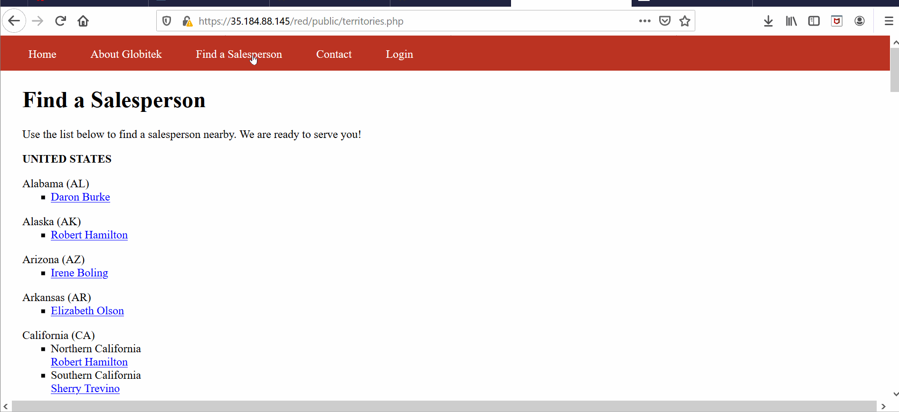
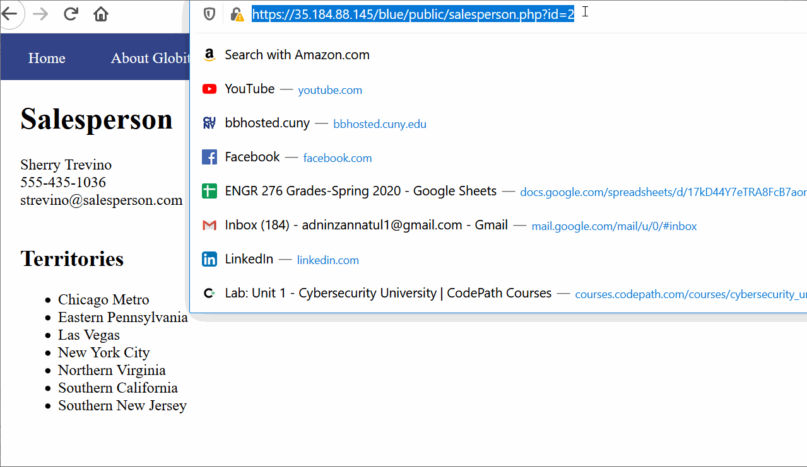
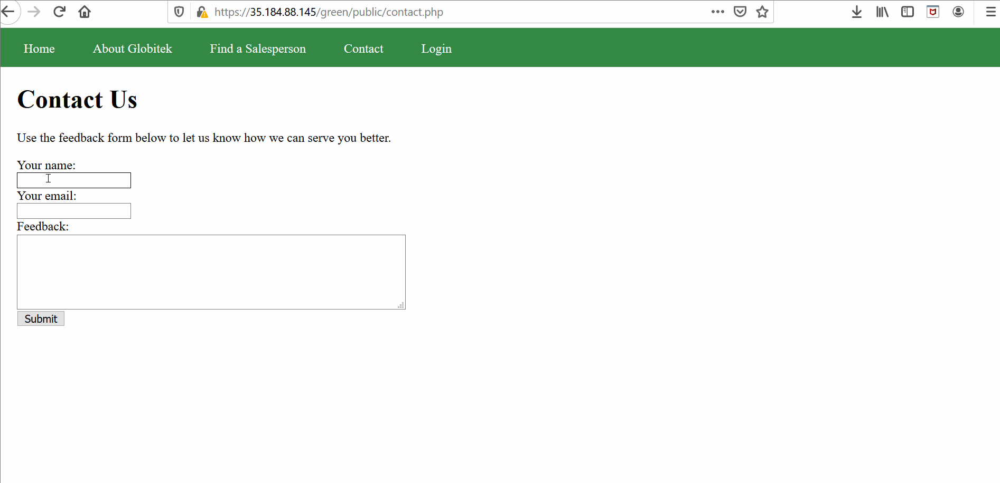
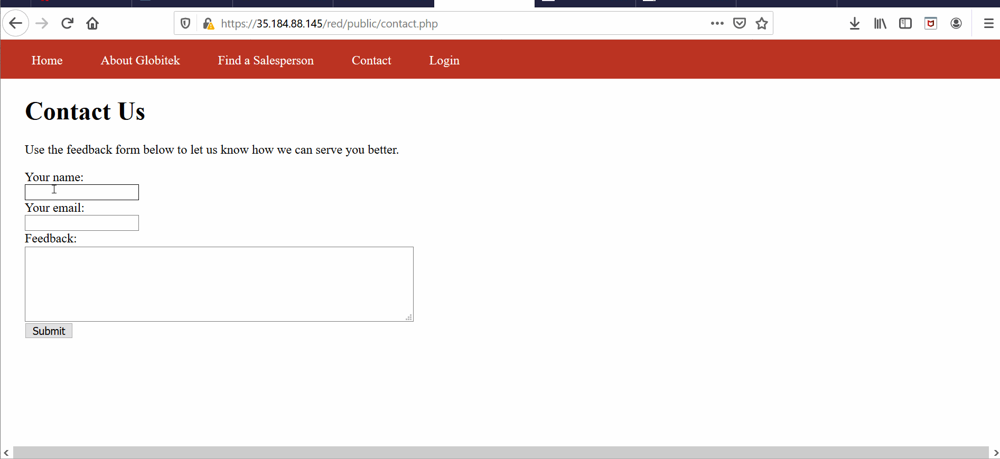
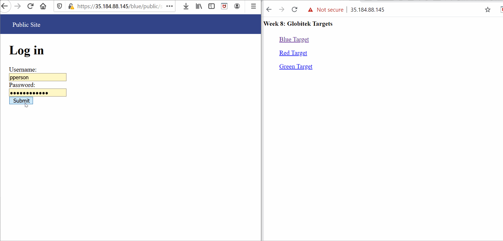

# Week9
1. Username Enumeration: For an existed username wrong input for password shows an error message in bold. But, for an username that does not exist the error message is not showed in bold. Thus a hacker can figure out if an username is existed. 
   - Gif walkthrough
         
 
 
 2. Insecure Direct Object Reference: It reveals staff info by directly eccessing the staff pages by their id
    - Gif walkthrough
   
 
 
 3.  SQL Injection: 'OR SLEEP(8)=2--' extention in the url for staff info messes up with sql query to discover a vulnerability.
    - Gif walkthrough
    
 
 
 4. Cross-Site Scripting: Left a feedback in the contact option and wrote  to for xss exploit.     Then logged in as admin and clicked on feedback which showed the alert message.
     - Gif walkthrough
                

5. Cross-Site Request Forgery: Left a link that is actually a hidden form in feedback. Then logged in as admin and went to the feedback. When the link is visited as an admin, the form gets submitted hacking the database.
     - Gif walkthrough
     

6. Session Hijacking/Fixation: The website is visited from two different browsers. One is logged in as admin. Added the extention 'hackertools/change_session_id.php' in the existing url. It gave the logged in session id of the admin. The id is copied. Then same extention is used in the other browser which is not logged in as admin. The session id is changed to the admin's session id that was copied. Now, the user can press the login option and can access the account without having admin info. 
     - Gif walkthrough
     
     
